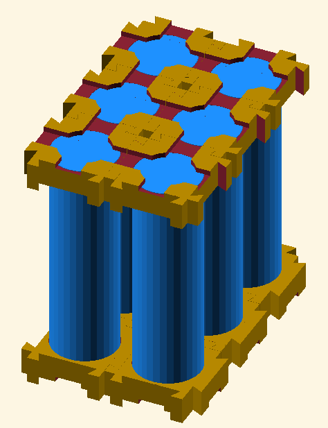

# BattPackSCAD

**BattPackSCAD** is an OpenSCAD library for designing customizable battery holders for cylindrical cells. It is highly modular and supports a variety of configurations, making it ideal for creating battery packs of different sizes and layouts.

## Features

- **Parametric Design**: Fully adjustable dimensions for cell diameter, holder thickness, connector depth, and more.
- **Extensibility**: Modular structure allows easy integration with other OpenSCAD projects.
- **Examples**: Includes example scripts to demonstrate usage and customization.

## Examples

To get started simply import the libraries and start customizing:

```
use <BattPackSCAD/battery_holder.scad>;
use <BattPackSCAD/battery_lib.scad>;
```


### 2x3 Grid Example

See `examples/gridconfig_2x3_example.scad`.



### Simple Example

See `examples/simple_example.scad`.


## Acknowledgement

This library is a continuation of the work [kartchnb/battery_lib](https://github.com/kartchnb/battery_lib) and [thingiverse/delboy711/Parametric-18650-battery-grid](https://www.thingiverse.com/thing:3026658).
